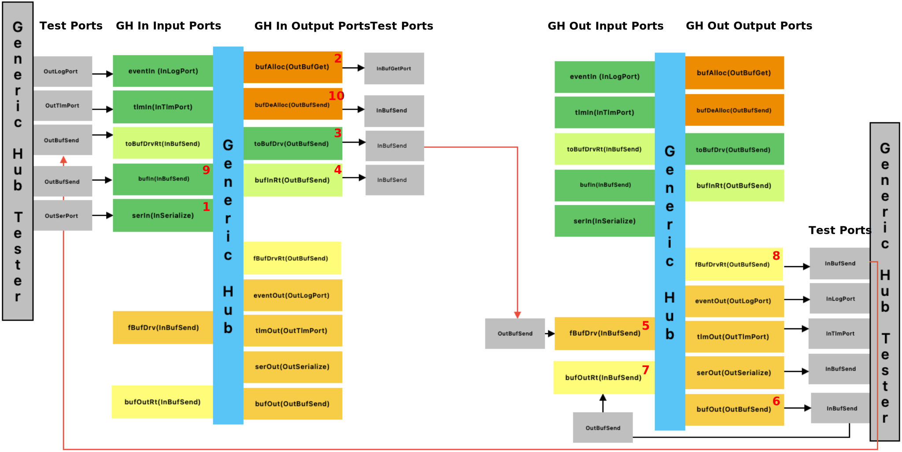
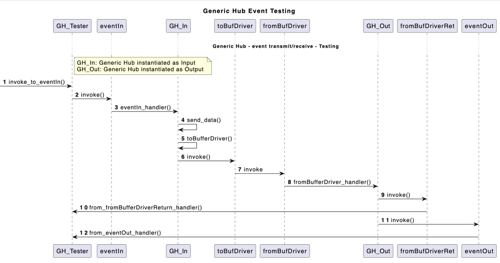
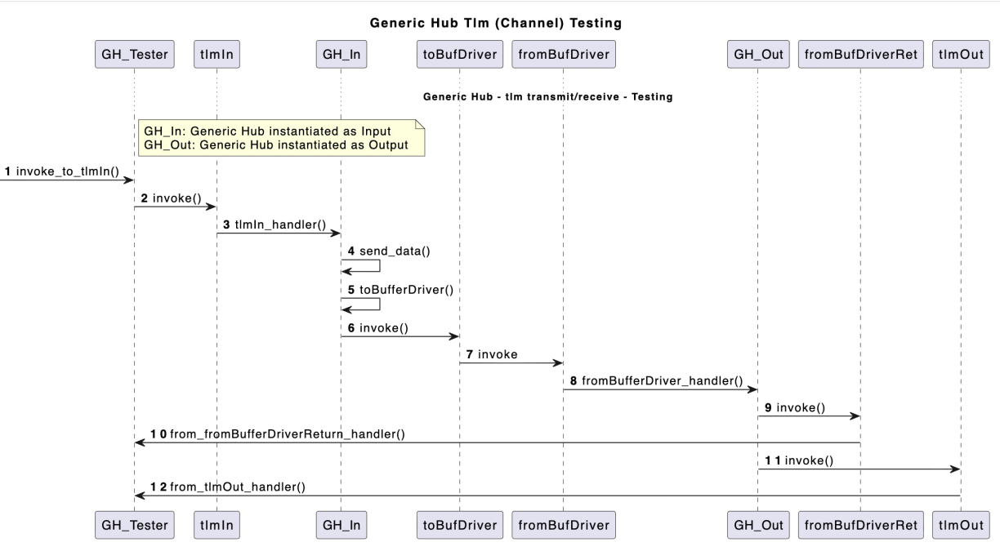

# GenericHub Unit Testing

Two Generic Hub component are instantiated in the unit test; one being the data transmitter and the other one being the receiver. In these unit tests, the two Generic Hubs are directly connected to each other. In real world Generic Hub will be connected to a buffer driver, that will interface with its counterpart on the other side. 

## Testing Configuration
### Configuration 1 

In this test configuration data from the event-in, tlm-in or serial-in ports is processed by Generic Hub-In and sent to Generic Hub-Out via toBufferDriver port. Generic Hub-Out receives it on fromBufferDriver port, processes the incoming data and sends it to one of the corresponding output ports. Unit test verifies the data sent on input ports of Generic Hub-In matches to the data coming out of the output ports of Generic Hub-Out.

In this test method a port connection is also established fromBufferDriverReturn port of Generic Hub out to toBufferDriverInReturn. This is done to test that original buffer allocation from Generic Hub In is deallocated after the test.

**Note:** The two Generic Hubs are directly connected in this test, instead of being connected via Buffer Driver. The red lines show the interface between the two hubs 

The numbering (1,2,3..) in red shows the order in which the data will be processed by the two Generic Hub components 

For more details see Events/Tlm/Serial data transfer sequence diagrams below

### Test Method 2

In this test method data from the buffer-in port is processed by Generic Hub In and sent to Generic Hub Out via toBufferDriver port. Generic Hub Out receives it on fromBufferDriver port, processes the incoming data and sends it to one of the corresponding output ports. Unit test verifies the data sent on input ports of Generic Hub in to the data coming out of the output ports of Generic Hub Out.

In this test method a port connection is also established fromBufferDriverReturn port of Generic Hub out to toBufferDriverInReturn. This is done to test that original buffer allocation from Generic Hub In is deallocated after the test. 

The numbering (1,2,3..) in red shows the order in which the data will be processed by the two Generic Hub components 

For more details see buffer data transfer sequence diagram below

## Sequence Diagram

### Scenario for Events-In/Events-Out Testing

### Scenario for Telemetry-In/Telemetry-Out Testing

### Scenario for Serial-data-In/Serial-data-Out Testing

### Scenario for Buffer-data-In/Buffer-data-Out Testing

