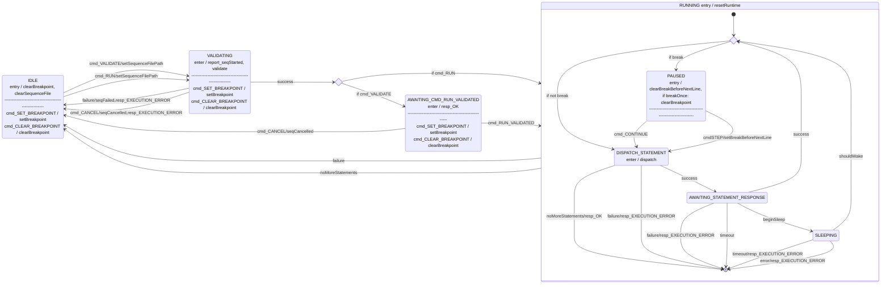

# Svc::FpySequencer

**The FpySequencer is currently in development. Use at own risk**

The FpySequencer loads, validates and runs up to one Fpy sequence at a time.

The FpySequencer is primarily composed of a state machine and a runtime environment. The state machine controls the loading, validation, starting and stopping of the sequence, and the actual execution takes place in a sectioned-off runtime.

The FpySequencer runs files compiled by `fprime-fpyc` (in the `fprime-gds` package). See the compiler documentation for the details of the Fpy language.

> [!CAUTION]
> The FpySequencer depends on `float` and `double` conforming to IEEE-754 standard on the target system. Users should ensure `SKIP_FLOAT_IEEE_754_COMPLIANCE` is defined as `0` to guarantee compliance.

> [!CAUTION]
> The FpySequencer depends on a 2's complement representation of integers.

## Requirements

| **ID**      | **Requirement**                                                                                                                                   | **Verification**                |
| ----------- | ------------------------------------------------------------------------------------------------------------------------------------------------- | ------------------------------- |
| FPY-SEQ-001 | The sequencer shall support branching on conditionals.                                                                                            | Unit Test                       |
| FPY-SEQ-002 | The sequencer shall support arithmetic and logical operations on 64bit signed, unsigned, and floating point numbers.                              | Unit Test                       |
| FPY-SEQ-003 | The sequencer shall support accessing telemetry.                                                                                                  | Unit Test                       |
| FPY-SEQ-004 | The sequencer shall support accessing the parameter database.                                                                                     | Unit Test                       |
| FPY-SEQ-005 | The sequencer shall support calling subroutines with arguments and a single return value.                                                         | Unit Test                       |
| FPY-SEQ-006 | The sequencer shall support scoped variables.                                                                                                     | Unit Test                       |
| FPY-SEQ-007 | The sequencer shall support executing directives at relative times.                                                                               | Unit Test                       | 
| FPY-SEQ-008 | The sequencer shall support executing directives at absolute times.                                                                               | Unit Test                       | 
| FPY-SEQ-009 | The sequencer shall support sequence-local variables.                                                                                             | Unit Test                       |
| FPY-SEQ-010 | The sequencer shall support dispatching commands with dynamic and constant arguments.                                                             | Unit Test                       |
| FPY-SEQ-011 | The sequencer shall support running sequences with arguments.                                                                                     | Unit Test                       |
| FPY-SEQ-012 | The sequencer shall read a binary-encoded sequence file of the format described in [TBD]()                                                        | Unit Test                       |
| FPY-SEQ-013 | The sequencer shall support sending commands for dispatch.                                                                                        | Unit Test                       |
| FPY-SEQ-014 | The sequencer shall support parameterized sequences.                                                                                              | Unit Test                       |
| FPY-SEQ-015 | The sequencer shall support conversions between F Prime signed, unsigned, and floating-point primitive types and their equivalent 64-bit types.   | Unit Test                       |
| FPY-SEQ-016 | The sequencer shall support exiting the sequence execution with a specified exit code.                                                            | Unit Test                       |
| FPY-SEQ-017 | The sequencer shall support looping constructs.                                                                                                   | Unit Test                       |
| FPY-SEQ-018 | The sequencer shall support NO OP functionality.                                                                                                  | Unit Test                       |
| FPY-SEQ-019 | The sequencer shall support working with complex modeled data structures (Arrays, Serializables).                                                 | Unit Test                       |
| FPY-SEQ-020 | The sequencer shall support setting flags as described in the [Flags](#flags) section via command and sequence directive.                  | Unit Test                       |
| FPY-SEQ-021 | The sequencer shall support the directives described in the [Directives](#directives) section.                                                    | Unit Test                       |

## States

The following diagram represents the states of the `FpySequencer`.

## Flags
The FpySequencer supports certain boolean flags which control the behavior of the sequencer while running a sequence. The flags can be accessed and modified by the sequence itself, or by command while a sequence is running. When a sequence starts running, the flags are initialized to a value configured by the FLAG_DEFAULT_XYZ parameters.

| Name | Description | Default value (configurable) |
|---|------------|---|
|EXIT_ON_CMD_FAIL|if true, the sequence will exit with an error if a command fails|false|

## Commands
| Name | Description |
|-----|-----|
| RUN | Loads, validates and runs a sequence |
| VALIDATE | Loads and validates a sequence. Mutually exclusive with RUN |
| RUN_VALIDATED | Must be called after VALIDATE. Runs the sequence that was validated. |
| CANCEL | Cancels a running or validated sequence. After running CANCEL, the sequencer should return to IDLE |
| SET_FLAG | Sets the value of a flag |

## Debugging Commands
The FpySequencer has a set of debugging commands which can be used to pause and step through sequences. They should not be necessary for nominal use cases.

| Name | Description |
|-----|-----|
| SET_BREAKPOINT | Sets a breakpoint at the specified statement index. When reached, execution will pause before dispatching that statement. |
| BREAK | Immediately pauses execution before dispatching the next statement. Will break once, then continue normal execution. |
| CONTINUE | Continues automatic execution of the sequence after it has been paused. If a breakpoint is still set, execution may pause again. |
| CLEAR_BREAKPOINT | Clears any set breakpoint, but does not continue executing the sequence. |
| STEP | When paused, executes the next statement then returns to paused state. Not valid during automatic execution. |
| DUMP_STACK_TO_FILE | Writes the contents of the stack to a file. Not valid during automatic execution. |

## Directives
See `directives.md` for documentation on all directives.
